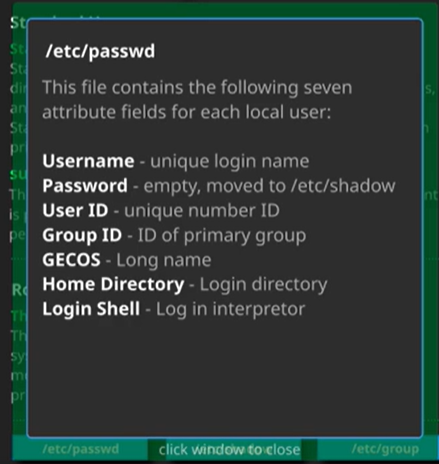
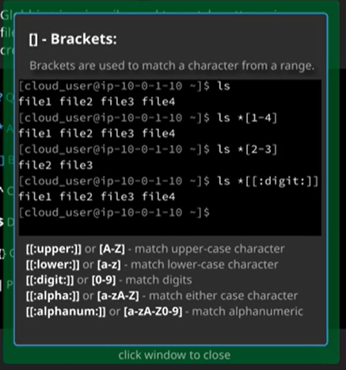
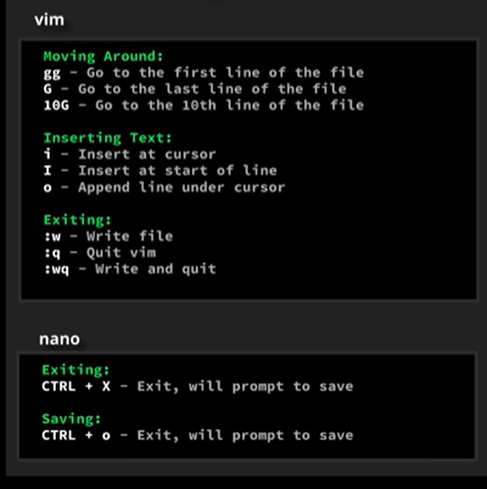
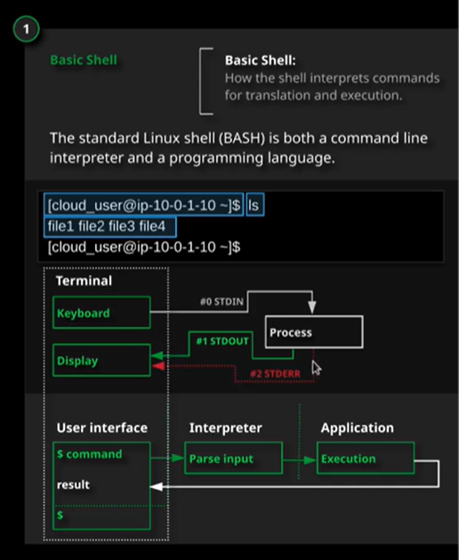
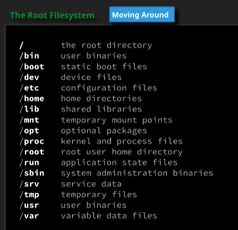
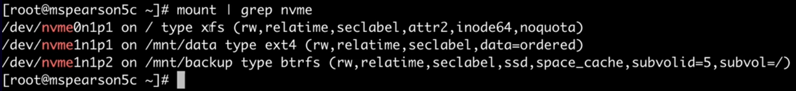
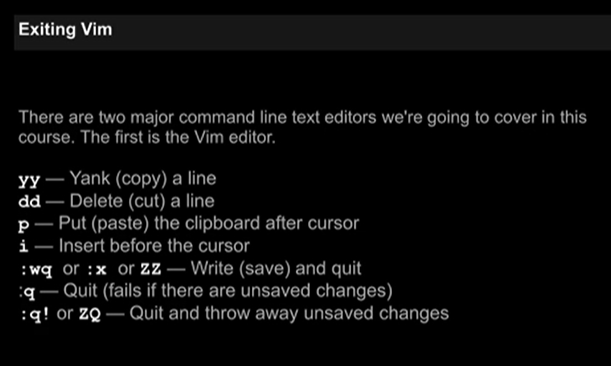
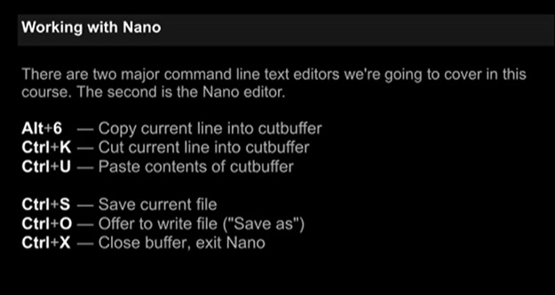

# Linux Red Hat Study Notes

**Greetings! I'll be publicly documenting my Linux upskill experience here. Cloud and DevOps professionals have been constantly stating that Linux is an important skill to have in the space so I'm going to spend a few months building those skills via courses and hands on labs. I highly doubt I'll be taking any Red Hat certifications but who knows. Maybe I'll attempt it.**

## 11.20.2024

**Today's Topics**
* LPIC-1 - Exam 101: (Chapter 1 continued)

Lets talk about the Linux boot process. The computer starts and the BIOS on the motherboard checks out the input and output for all hardware devices. If everything works, the boot process can begin. The boot program (GRUB) will look for the section of the harddrive that contains the data needed to boot an OS. This boot loader will then load the Kernel. The kernel will then load an initial RAM disk. Then, the kernel starts off the initialization system. This loads the services and eventually discards the initial RAM disk. 

You can see boot logs using `dmesg` (the traditional utility used for viewing the kernel ring buffer) and `journalctl -k` (systemd utility to view the kernal ring buffer within the systemd journal). 

Init is short for initialization. After the Linux kernel loads up and brings in the initial RAM disk, it seeks out an initialization system to hand over control of the computer. It's going to look at /sbin/init first. The kernel will start it once it locates it. Then the init program is in control. It will first look at the /etc/inittab file for configurations. It will look for a Runlevel. What's a runlevel? A runlevel is a predefined configuration that the computer will operate within. It's 7 runlevels from 0 to 6. 

Each line in the `inittab` file has a few fields: <identifier>:<runlevel>:<action>:<process>. I will definitely be rewatching all of these videos. 

`upstart` is like `init` but it offers asynchronous starting of services which can decrease boot up times. It can work on real-time events. 

A change on a Linux system is an event. An event triggers a job. Jobs can be in two categories: Tasks and Services. 

A Task will do what is requested of it and then return to a waiting state after it's finished. A Service will continue to run unless a daemon stops it or the system admin kills the process. 

Lets talk about `systemd`. Where did this come from? So `init` and `upstart` rely on Bash shell scripts to boot up your computer. The issue with this is the script files create additional processes and have to open Bash libraries in order to run all the scripts. This uses unnecessary resources and slows down the boot time. `systemd` replaced these Bash script files with compiled C code which runs faster. Requires less resources. `systemd` uses Unit Files to boot You can find the unit files in /etc/systemd/system. To see all the unit files on a system, use the command `systemctl list-unit-files`. 

Here are the components of the Unit File. 
- [Unit]
- Description=<describes the system>
- Documentation: <this is where you put the documentation for this unit file>
- Requires=<lists out the unit files that will be activated when this unit is activated>
- Conflicts=<indicates what units can NOT be running while this one is running>
- After=<says whatever is listed here must be started before the unit that this file is for will be started>

## 11.19.2024

**Today's Topics**
* LPIC-1 - Exam 101: (Chapter 1)

A regular file system is a method of laying out files and folders on a physical hard disk. A pseudo file system does not exist on a physical hard disk. It's also not persistent because it only exists in RAM. `/proc` and `/sys` directories are pseudo file systems. 

`/proc/` contains information about the processes running on a system. You can see them by PID. `/sys` contains information about the system's hardware and kernel modules. 

`uname` stands for Unix name. Use this to display information about currently running kernel. `lsmod` displays a listing of all currently loaded kernel modules. `modinfo` displays information about a specified kernel module. `modprobe` command used to dynamically load and unload kernel modules at runtime. 

A few commands that could be useful for listing specific devices: `lspci` (for PCI devices), `lsusb` (for USB devices), `lscpu` (for CPU processs info), and `lsblk` (for all block devices (think external harddrives)). 

## 11.18.2024

**Today's Topics**
* Introduction to Databases on Linux (Chapters 3 - 5)

Relational databases were created in the 1970s. SQL - structured query language. Used to manipulate databases. It's an ANSI/ISO standard. Common commands are Select, Update, Insert Into, Delete, Create, Drop, and Alter. 

PostgreSQL - highly extendible RDBMS, with support for many extensions and stored procedure languages. It supports connections using TCP/IP and local UNIX sockets. 

MariaDB - hihgly flexible RDBMS with support for multiple storage engines. It was forked from MySQL when it was purchased by Oracle. Interesting. 

CouchDB - an open-source, distributed (shared-nothing architecture) multi-model NoSQL document-oriented database. Whatever that means. 

MongoDB - a document database designed for ease of development and scaling. 

Apache Cassandra - an open source, distributed NoSQL database. 

Distributed DBs are just high availability infrastructure so think of it like that. + DBs are closer to the user for lower latency. 

That wraps up databases! I still don't necessarily know what's going on but I get the foundation of it. I'm going to leave DBs alone until I really need it. On to the LPIC-1 course. 

## 11.17.2024

**Today's Topics**
* Introduction to Databases on Linux (Chapters 1 - 2)

A databse is an organized collection of data. The first database was a physical database on paper in 1890. Also, JSON format was created in 2001. 

CSV - comma separated values. Never knew what this stood for. Basic Rules
1.) Data is stored in fields/columns separated by the comma character.
2.) Records/rows are terminated by newline character
3.) A specific character encoding, byte order, or line terminator format, is not required.
4.) All records should have the same number of fields, and be in the same order
5.) Data within fields is interpreted as a sequence of characters, not as a sequence of bytes. 

XML - eXtensible Markup Language. It's a markup language much like HTML. It was designed to store and transport data in a way that is both human and machine readable. 

I'll be the first to say this course is not so great and I don't like it. Not nearly enough information has been given regarding these databases and the formatting is very weird. There are 10 labs. I'm going to complete them. 

Well, I did just learn you can open Python on the CLI by just typing `Python`. You can also exit by pressing ctrl + D. This combo is similar to Ctrl + Z in the Cisco CLI. 

So we did queries on Berkeley DB, CSV, XML, and JSON files. The easiest and most readable formats were CSV and JSON for me. I was able to do my own made up queries on JSON actually. Definitely easier to follow. 

## 11.16.2024

**Today's Topics**
* Linux User Management Deep Dive (Chapter 5)

So it seems like you edit the `visudo` file to change sudo permissions for your system. You can assign users root-level access if you want. I believe that's what's happening. Will check with Chat GPT. visudo also runs a syntax check before saving the file. Or running the file. 
"Sudoers allows particular users to run various commands as the root user, without needing the root password."

`ALL=(ALL)      ALL`. Lets break this down. The first all indicates which hosts that a user can run commands on. This is the person making the commands. The second ALL is for the target user. The last ALL indicates the commands that can be run. So you can run all commands. I still don't understand the second ALL completely.  

Before you remove a user, make sure you find the files, directories, and processes before you do so. Use `ps U <user_name>` to see which processes are being completely by a user. Check the `man` pages for all the options. Then, you can do `kill <PID>` to terminate the process. Use `find / -user <user_name>` to find the files and directories associated with a user. 

With `chmod`, you can load up the users and groups. You can do `chmd og+rw <file_name>`. Look into the instructions. It will definitely make this entire process easier. 

Set UID (SUID), Set GID (SGID), and sticky bit. The SUID executes a file as the owner of the file and not the user running the command. So like, the root user can run the command but the system will see it as the owner of the file (user1) actually running the file. Sticky bit allows for a user to only edit files or directories that they created. 

A file mask is the maximum amount of settings a file or directory can have when created. You can see this when you use the `umask` command. The number of maximum permissions overall is 777. The default function when creating folders is 777 and for files are 666. `umask` returns 4 digits. The first digit is for special permissions. The next 3 are owner, group, and other. Whatever this digit is, you subtract it from 7 to get what the default permissions will be when you create a file or folder. 

I'll have to return to the quotas. That was a bit confusing. 

## 11.15.2024

**Today's Topics**
* Linux User Management Deep Dive (Chapter 4)

Lets look into the fields for /etc/shadow. username:<hashed password with salt>:last password change (in days):minium number of days required between password changes (set to 0 for password change at any time):the maximum number of days the password is valid:the number of days before a warning message about changing your password is sent:the number of days until an account will auto-disable:the number of days that an account has been disabled

All of these fields can be changed via `passwd`. Look at the options. 

(You can actually tell which hashing algorithm is used (like SHA-256) by looking at the first number of the hashed password. They're separated by the $ signs.)

Use `chage -l <user_name>` to see all of the password attributes for a user. You can also see the options using `chage -h`. This is all good for password management. It's like AD but just not as pretty. 

If you lock a user's password, they can no longer use that password but they can still access a server in different ways where the password isn't required. If you disable a user's account, they can't use that account. Just be familiar with differences for security reasons. 

## 11.14.2024

**Today's Topics**
* Linux User Management Deep Dive (Chapter 3 continued)

We remove a user using the `userdel` command. You should remove the files and processes related to the user before you do this though. You can use the `find` command to search for anything else the user has a hand in. 

Use the `groupadd` option. You can use the additional options to get very specific about how to add groups. You can automatically assign a group a Group ID. This is good for automation and simplification with typos just in case user group naming conventions get out of hand. You can also add a user and give them a primary and secondary group all in one command. Get familiar with these commands. 

You can modify groups using `groupmod`. You can change the GID and the name of the group using this command. Always check the `man` output for these commands. Also, use `groupdel` to delete groups. 

`gpasswd` is used to administer /etcgroup and /etc/gshadow. Use it to set group passwords and the users who are able to use this password. 

`pwck` verifies the integrity of the users and authentication information. It also checks the etc/shadow file. Basically it makes sure your password isn't corrupted. 

`grpck` does the same thing just for groups. Be careful. These commands can delete users if it finds corrupted files. 

Now we have `pwconv` and `grpconv` commands. They create shadow from the passwd commands. Apparently we won't be using this much so I'll save my bandwidth until I need to come back to this. 

You can use the `id` command followed by the username to see the user's ID, primary, and secondary group. 

I'm piecing together a connection for the chmod and chown. When you do `ll` and see the file permissions for user, group and everybody else, I'm assuming you need to change this first before you give a group permission over a file. If the user or group doesn't own the file, there's no point in giving them permission over the file because I would assume it shouldn't work. So always check the permissions on the file first, transfer ownership to the correct user, and then give that user or group the correct permissions over the file. Use `chown` for transferring ownership and use `chmod` for changing permissions. Remember, the `o` flag is for user and tthe `g` flag is for group. Then you can simply put r, w, or x to change the permissions. You can also use the numbers. We'll practice both ways. 

## 11.13.2024

**Today's Topics**
* Linux User Management Deep Dive (Chapter 3)

/etc/login.dev file is where you can set the default parameters for the UID_MIN, MAX, Group MIN, MAX, and other fields for your users and groups. 

When you create a user, Linux also creates a group for that user with the same name as the user. Just be aware of this. 

## 11.12.2024

**Today's Topics**
* Linux User Management Deep Dive (Chapter 1 - 2)

UID (User Idenifier) Ranges
- UID 0 - superuser or root user.
- UID 1-200 - system users. ID range for system users for system processes. These are statically assigned by the system
- UID 201-999 - system users. ID range given to system users for system processes but dont know files on the system. These are dynamically assigned when the packages that require them are installed. These user IDs have restricted access only to the resources they need for operating
- UID 1000+ - regular users. ID range assigned for all regular users.

Use the `id` and `groups` command to see the user and group that you belong to. You can be in a primary group and a secondary group. You can find all of this user and group information in the /etc/ directory. 

A shell is a program that acts as an interface between the user and the OS kernel. A shell is created for each user once their profile has been created. It's usually /bin/bash which is for Bash. If you set a user shell to /sbin/nologin: and they try to log in, they'll receive the message "This account is currently not available." You have to create the file /etc/nologin.txt first though. If you use /bin/false:, then this will also automatically log a user out. 

Home Directory - the directory in which a user enters upon login. Also, keep in mind. If you copy files over to another user's file system or directory, you would also need to change the file permissions over to the new user. 

Just a reminder, if you see the /etc/passwd output, the format is. user:password:userid:groupid:GEKOS:HomeDirectory:LoginShell. You can see the actual password by going to the /etc/shadow but only the root user can see this. You can also see password management information here. It's about 8 fields. The password for groups is set in the /etc/gshadow file. The other fields in the group output are the group administrator and the members in the group (separated by commas). 

## 11.11.2024

**Today's Topics**
* LPI Linux Essentials (labs)

You can find which groups a user belongs to by navigating to the `/etc/group` file. Cat the file and grep out the user you're looking for. The information will be there. You can also use `groups <user_name>` to also find this information. 

To find a user's home directory, you can use the following two commands: `getent passwd <user_name>` and `cat /etc/passwd | grep <user_name>`.

Lets add some users and groups now. To add a user, just use `useradd <user_name>`. To add a group, just use `groupadd <group_name>`. To add a user to that group, use `usermod --append --groups <group_name> <user_name>`. Easy. 

Use the following command to change the OWNERSHIP (not file permissions) of a file or directory: `chown -R (new_user_owner>:<new_group_owner> <file or directory name>`

Use the following command to change the file/directory PERMISSIONS: `chmod <u (user) or g (group) + <w,r,x,> <file or directory name>`. For example, `chmod g+rx /home/susan`

## 11.10.2024

**Today's Topics**
* LPI Linux Essentials (labs)

`/usr ` stands for Unix System Resources. And remember, `/bin`/ and `/sbin/` stands for binary and system binaries. 

`df` stands for disk free. Use this to see how much storage you have available. You can also find the number of CPUs and their speed in the /proc/cpuinfo directory. You can see how much RAM is installed in the /proc/meminfo directory. You can see the swap memory being used by using the `free -m` command. Lastly, you can see the BIOS version using the `dmidecode` command. 

Use `ps aux` to see which processes are being ran. Use the `uptime` command to see the current system load. 

You can use the command `cat /etc/resolv.conf | grep nameserver` to find your DNS server. Remember, you can find your IP, MAC and DG using the `ip addr show` and `ip route show` commands. 

## 11.09.2024

**Today's Topics**
* LPI Linux Essentials (5.1 - 5.4)

`sudo` stands for super-user do. I'm getting really tired of these Linux command names. It's like they didn't even expect for people to ever truly use it in the future. 

There are 7 user attribute fields: username, password, user ID, group ID, GECOS (long name), Home Directory, and Login Shell. The password is saved as a hash so you'll just see an 'x' for that. These are for human or standard users. There are different types of users other than root and standard. 

System users are generally deployed when applications are installed, their home directories are set to application folders, and they normally do not have a login shell. The purpose of having discrete users is to separate functional privileges from other applications and services. 

## 11.08.2024

**Today's Topics**
* LPI Linux Essentials (4.2 - 4.4)

Computer hardware reviw. Central Processing Unit (CPU) - processes computer functios and performs calculations. Random Access Memory (RAM) - high-performance, volatile storage. Secondard storage (Hard drive) - persistent storage for data not currently in use. Network Interface Card (NIC) - permits connections to network. Then input and output devices like mouses, keyboards, and monitors. 

Hardware drivers reside in the running kernel (or are loaded as a module) and enable the operating system to use the hardware. 

`/boot` contains the boot loader configuration files and parameters. `/etc` contains many useful directors including `/fstab` for partition mount points, `/passwd` for local user attributes, `/group` for groups, and `/hosts` for IP addresses and hostnames. 

All processes have a process ID or a PID. You can find process data by going to `/proc/<PID>/`. You can view the running processes by using the commands `ps aux` and `ps -eF`. You can also use the command `top`. 

System messages are messages from out kernel. They're sent from the kernel ring buffer. You use `dmesg` to see this information. The kernel ring buffer holds messages related to the operation of the kernel - a ring buffer is simply a buffer of a constant size. 

Logging - common locations for system and application log data. You can get to the log directory via /var/log. The common logs are messages (general system logs and messages), syslog (for Debian-based systems), auth.log (authentication logs), secure (for Red Hat-based systems), boot.log (system boot logs), cron.log (Cron job logs), kern.log (Kernel logs), and faillog (authentication failure logs). 

Cron is kind of a like a task scheduler. Seems pretty powerful. 

Now for the good stuff. Networking. You can use `ip addr show` to see your device's IP address. You can also use the `dig` command to get DNS information for a resource. 

You can use `ip route show` to see the route table. I think it just shows you what your default gateway is (in the first line) and it shows the subnet that you're on. It also says the device that's the next hop. 

Instead of `ifconfig`, start to get familiar with `nmcli`. You can also use `netstat` and `ss` to see what devices are on the network. 

## 11.07.2024

**Today's Topics**
* LPI Linux Essentials (2.4 - 4.1)

Lets managed some folders! Use the `mkdir`, `cp`, `mv`, and `rm` commands to make, copy, move, and remove folders. 

Files are case sensitive. That's when you're manipulating them in any way, even searching for them. Also, you can use the `mv` command to rename files. Ask Chat GPT about this. 

Globbing - a useful way to search for information. Think of how a wildcard asterisk can represent "anything". This is what gobbling is. We have a few ways to go about it. Lets start with the question mark `?`. The question mark represents any ONE CHARACTER. So if you have `file?`, then Linux will search for all things that start with `file` but end with any one character. If you have `???`, then Linux will search any file that is 3 characters long. If you have `????4`, then Linux will search for a 5 length-file that starts with anything for the first 4 characters but ends in the number 4. 

The asterisk represents any character that is ANY length, not just 1 character. So if you search *4, you will get any file that ends in 4 such as file4, LinuxIsFun4, Windows10.4, etc. Anything length of characters. But wait, there's more. You can also use brackets to further constrain your search. Check the chart below and make sure your syntax is correct. 

Archiving is the process of combining multiple files and/or directories into a single file. We'll be using `tar` (tape archive) for this. I'll need to practice these options. 

Lets talk compression. Compression is the process of reducing the amount of storage that files or archives consume. We have different compression options. We have gzip (default compression for tar), bzip2 (an alternative. usually slower than gzip due to higher compression), and zip (the same compression as Windows. popular). 

I'll definitely have to practice all of these tar flags. I don't understand them fully right now. 

Piping - the process of taking the output from one command as the input to another command. Quick detour, you can use `grep <word you want to search> <file you want to search in>`. Back to piping, the left side of the pipe is the output from the original command and it will use this output as the input to the command on the right side of the pipe. 

I/O redirection may be used to feed input to  comand from a file, or to send the output of a command to a file. This is the same thing as `echo "whatever_output" > file.txt`. I don't understand when we would use "read input from a file". Seems very arbitrary. 

Regular Expressions (regex) - used to match patterns in text, similar to globbing. Seems like a powerful too but I don't see why we would need it just yet. Seems like an extension of `grep`. Update: we did a few labs using regex and I can definitely see how powerful it is. I still need to practice this. Its like solving a puzzle. 

## 11.06.2024

**Today's Topics**
* LPI Linux Essentials (continued)

A "computer" is RAM, storage, and CPU. That's it. 
The "$" at the end of the prompt string denotes that the current user is unprivileged. So basically, you're not the root user. If you see the "$" sign, you're unprivileged. Think of it as the ">" sign in the Cisco CLI where you're in User EXEC mode. On the other end, if you're the root user, the end of the prompt will have a "#" sign. This is the same way in Privileged EXEC mode in the Cisco CLI. 

Commands in the Terminal are entered in as Standard In (STDIN). This follows a syntax. The output is either Standard Out (STDOUT) or Standard Error (STDERR). See below. 

Linux commenting starts with a pound sign (#). 

Dot files are hidden files. You can see these when you do `ls -a` or `ls --all`

"Bash takes your input and parses it—meaning it breaks it down into parts (or "tokens") to understand what you’re asking it to do." This comes into play if you have like, a command, the option, and then the object that it's acting on. Parsing just means analyzing each section of the command (because commands can have options and objects too) and then either interpret the entire command or return an error. This is "parsing a command".

Options are also called flags in Linux. You can group flags together. So instead of `ls -a -h -l' or `ls --all --human-readable --long-format` (which is called long format btw. Might be helpful to do it this way before you do the shorthand), you can just type `ls -ahl` altogether. Definitely convenient but you should check the `man <insert command>` info to know exactly what each option stands for and does. 

There are "hard-coded" BASH variables that you can't alter. Those three are $HOME (the current user's home directory), $PS1 (the primary prompt string) and $PATH (a colon-separated list of directories where the shell looks for commands). Don't trip too much on this right now. I actually don't even think we'll need $PS1 at all. 

Give a variable a value using `<variable_name>="<whatever value or string>"`. Now to reference that variable, you must use `$<variable_name>`. You must use that dollar sign. You can check this by doing `echo $<variable_name>` and getting the desired output. 

Go back over the `echo $PS1`  output. This will show you what those SecureCRT automatic commands are doing. This is all Linux scripting!!!

You can assign a variable a value of an output by doing `<variable_name>=$(<command_name>)`. For example, you van do `var1=$(ls)` to assign the variable `var1` the output of the `ls` command. Use `echo` to see the output. 

Quoting - used to disable special treatmeant of certain characters and words, as well as to prevent parameter expansion and preserve what is quoted. Basically you can put the quotes around an input for a variable so that it takes that entire value or string. Or paragraph. Whatever you put in there. If you don't put the quotation marks and you have a space, the terminal will return an error. Now, you can use the `\` character to move preserve the value of the next character. 

Also, with single quotes so '', this will take the exact value of everything in the single quotes even the escape character `\`. So it doesn't acknowledge any variables. It basically takes the string character for character. 

Double quotes will acknowledge the variable values but it will take the character value of the escape character. 

You can use `cd ~` to change to your user's home directory. The tilde is for the home directory. 

When you do `>` to redirect the output of a command into a file, you will overwrite the entire file with the new output. If you want to add the output to the end of a file (this is called appending), you should use `>>` instead so you don't overwrite the file.

Colons `:` are used as delimiters in the file path. So basically it just breaks them up so you can include multiple file paths to a variable. So look at them like a comma pretty much. 

Yeah that backslash lab was kicking my a** lmao. It feel like choosing C 8 times in a row on a scantron sheet. Like this can't possibly be the right answer. I'll have to get more familiar with that aspect. 

You can just normally type in a manual page (man page) to search for whatever text you're looking for. This makes searching man pages easier. 

Info pages are more detailed man pages. Use `info <command>` to get to the info page. 

When we install a hard drive, we'll create a file system on that drive. It will follow the Filesystem Hierarchy Standard (FHS) for Linux. If you do a regular `cd`, it will take you to the home directory. `cd /` is the top/root level of the file system. 

The terminal has tab completion just like the Cisco CLI. Also, to go back to your previous directory (not up a directory but back to the one you just came from), use `cd -`. You can also use `cd ../..` to go up two levels.

If you put a period in front of a file or directory, it will be hidden. For example, file5 and .file5. To see them when you do a `ls`, use `ls -a` so they appear. 

A home directory is typically created for every ordinary user on a Linux system under /home. This is where you automatically land when you log into a user's profile. 

## 11.05.2024

**Today's Topics**
* Linux File System Permissions (continued again)
* Lab notes
* LPI Linux Essentials

SELinux labels are pieces of information. Not sure what they're used for. We also have SELinux Booleans which, once again, not really sure what this is required for. 

Sticky bits means that a file can be deleted only by the owner of the file or the owner or the directory. SetGID is useful for executable files. It sets the group owner of the process to the group owner of the file, regardless of who is running the command. SetUID is also useful for executable files. It sounds like this does the same thing as the setGID. Not sure what the difference is. 

We also went over `chatttr` and `lsattr` although we were told we probably won't run into this. 

The `su` in `sudo su - bob` stands for switch user or substitute user. 

Distribution - comprised of a kernel, GNU core, X server (display server for the GUI), and lastly the GUI. 

Hardware is incorporated into the file hierarchy through the /dev and /sys directories, and process information is mapped in /proc. Use `uname -r` to check the kernel version. Use `lsb_release -a` to see the distribution you're running. 

The GNU Core Utilities are the basic file, shell and text manipulation utilities of the GNU operating system. These are the foundational utilities expected to exist on every OS. 

Examples of embedded Linux systems: Android and Raspberry Pi. 

Completed a simple SSH lab. I've been doing this everyday for the past week so this was really easy. You can also who `whoami` to tell you which user you're currently logged in as. 

Typical (open-source) desktop applications: OpenOffice (think Microsoft office things like Words and Excel), LibreOffice, Firefox, Thunderbird (email client), and GIMP (basically Photoshop). 

Typical (open-source) server applications: Apache HTTP Server (web server), NGINX (web server + hella other stuff), MySQL, MariaDB, Samba (file sharing (uses CIFS)), Network File System (NFS, which is a protocol, not an application), and ownCloud (similar to Dropbox but stored on your own connected hardward), 

Development languages. Lets talk about it. A shell script is designed to be run by the CLI using various scripting languages. Bash is a common shell (born again shell). C is a general-purpose imperative programming language. Java is class-based, object oriented general purpose language. Javascript is used for web pages. You also have Perl, PHP, and Python. 

Packages - a collection of files needed to install an application. Debian packages - dpkg and uses apt-get (uses .dev files). Red Hat Package manager - rpm and uses yum (uses .rpm files). These commands also look up dependencies for each package and they also store metadata about the application. 

apt stands for Advanced Package Tool. yum stands for Yellowdog Updater, Modified.

Forking occurs when developers use the main source code and "fork" from it to create their own version of an open-source software. 

"Compilation is the process of taking the human-readable source code and translating it into a lower-level form called object code." So when a computer is compiling your code, it's taking whatever you wrote in your coding language (or in the case of like, Docker, just plain ol' sentences) and turning that into a binary code. The computer's hardware can only read binary which is 0s and 1s. So compiling is taking the human-readable code and turning it into computer food. 

## 11.04.2024

**Today's Topics**
* Linux File System Permissions (continued)
* Lab notes

Use `getfacl` and `setfacl` to get and set folder ACLs on a directory. This is if you want more granular control other than just octal permissions. I'm assuming the "f" in facl stands for folder. For the 5th category, you may see a "+" on the directory indicating there is an ACL applied there. 

Use `getfacl` to determine which rules are actually in place. Sometimes, we don't know if the ACL or the octal permissions are taking over. Do `getfacl` on the file or folder to make sure. 

Use `fdisk` to create a partition on a desk. 

## 11.03.2024

**Today's Topics**
* Linux File System Permissions

Octal permissions - this is the hierarchical file descriptions for Linux. 

First field is will be either `d`, `l`, or `-`. D means directory, L means simlink, and - (dash) means a file. 
R - read and the number is 4. W - write and the number is 2. X - Execute and the number is 1. 
The final field indicates a "special" permission such as SELinux, ACLs, or other similar settings for that file. 

There are 5 categories in the octal permissions. 
- Denotes if file is a directory, symlink, or file
- Denotes the owner file permissions
- Denotes the group file permissions
- Denotes the user file permissions
- Denotes "special" permissions

You use `chmod` to change the permissions on a file. The numbers after `chmod` give the owner, group, and user the designated permissions. The numbers are 0, 4, 5, 6, and 7 which 0 means no permissions and the other numbers are generated by adding the values of the read, write, and execute permissions. Read = 4 and Execute = 1. 5 + 1 = 6. 

Use `umask` to have some customized default octal permissions for each folder and file. I believe Linux gives a default value of 666 which might not be good for security. A umask helps avoid this. 

Root users override all permission settings. 
  

## 11.02.2024

**Today's Topics**
* Linux File System

Use the command `mount` to mount a directory. Use `umount` to unmount a folder. 

Lets break down each part of this. You have the device name. Then it's listed "on" the directory (see the second part. It has a directory name or simply "/" for the root directory). Then it tells you the type of file system. Then it shows you the options associated with that mount. 

Use `df` to see the disk space usage for each file system. Use the `-h` option to make it more human-readable. 

`blkid` and `lsblk` gives us information on our hard drive devices I believe. When he uses `lsblk`, it shows him all the hard drives, namespaces, and partitions. So I believe this is what the command does. 

"The lsblk command in Linux is used to list information about all available or specified block devices. Block devices are storage devices that provide data in blocks, such as hard drives, solid-state drives, and USB drives"

Use `fuser` followed by the mounted directory name to find out which process is using this directory based on the PID. You can either use the `-k` option to help kill off the process so you can unmount the directory. Also, use `lsof | grep ###` to get more information on this process. 

To keep directories mounted after you reboot the system, you need to list the mount directory information in the `fstab` folder. Use the UUID for this if you can since that never changes. 

Swap space is located on the physical, hard disk memory. All your computer processes are being run in the RAM so the processes that haven't been used for a while will be put into swap space so that they're not taking up too much RAM. Hard disk storage is for long term use. Use `swapon --show` to see the information on your swap space. You can have a dedicated partition or file for your swap space. Use the `mkswap <disk name>` command to create a swap space. 

All the resources that the Linux system knows how to operate on are called Units which contain unit files. We'll use `systemd` to manage these. The instructor created one of these from scratch to show how to mount a directory. This is a bit beyond me right now. 

Ext - extended file system. There are mutliple versions: ext2, ext3, and ext4. Use `mkfs` to make a file system. Choose a disk to partition. You can use `parted <disk name>` to start an interactice wizard to help you partition your disk. Then, you can start to create file systems on each partition. 

I learned about partitioning a disk back when I was studying for the CompTIA A+ but I didn't know what it was useful for or what exactly I was doing. Partitioning a disk is basically taking the physical disk space and separating it into isolated storage spaces. I would compare this to all the ports on a switch physically being in one VLAN (by default, VLAN 1) but then you use VLANs on the switch to created additional LANs. Lets say you divide all the ports equally into 4 VLANs. This is similar to partitioning a disk. 

Use `fsck` (file system check) to check and repair a Linux file system. 

"The `tune2fs` command in Linux is used to adjust various parameters of an ext2, ext3, or ext4 file system. It’s a powerful utility for changing settings on existing file systems without reformatting them."

"The `dumpe2fs` command in Linux is used to display detailed information about ext2, ext3, or ext4 file systems. It provides a "dump" of file system metadata, which can help you understand its configuration, usage, and status without modifying it."

"The `debugfs` command in Linux is an interactive utility for examining and debugging ext2, ext3, and ext4 file systems. Unlike `dumpe2fs`, which only shows file system information, debugfs is a more advanced tool that allows both viewing and modifying file system structures."

XFS is the default file system for RHEL. `nvme1n1p5` basically says we're using NVME in namespace 1 in partition 5. I needed this for my own sanity. A namespace is a logical division of a drive. Think of it as a virtual drive. Partitions and namespaces are very similar. You divide the drive into namespaces and the namespace into partitions. 

`btrfs` (short for B-tree file system) is the default file system for Linux. You can use btrfs convert to change other file systems to btrfs. 

The "d" in `systemd` and `smartd` stands for daemon. So keep that in mind. 

You can use `autofs` to automatically mount drives. You have to install it first though. 

He also went over disk encryption. 

## 11.01.2024

**Today's Topics**
* The Linux Kernel
* Build Your Own Linux Kernel from Scratch

`uname` gives us imoprtant information on our system. You can see the version of the Linux kernel here. The instructor then used a bunch of pre-configured commands to download the kernel source tree and required documentation. I didn't fully understand this so we'll have to revisit it. 

According to Chat GPT: 
"The Linux kernel source tree is the organized directory structure containing all the source code, configuration files, and scripts necessary to build the Linux kernel. It’s called a "tree" because the files and directories branch out hierarchically, similar to a tree structure, making it easier to navigate the various components of the kernel.
[the source tree includes]
- Core kernel code
- Architecture-specific code
- Device drivers
- File systems
- Networking
- Tools and utilities"

After working out my thoughts with Chat GPT, the instructor was just downloading a version of the kernel and customizing the kernel to behave in the way that he wants. So he was in the Linux CLI and created a new directory for a new kernel. In order to access this new kernel, he can point the boot loader to the new kernel and reboot his system. Then he can work directly on the new kernel. 

`cd /boot/` is where we can find out boot settings for our system. The vmlinuz files are your actual kernel. "bz" stands for Big Z image. You also just have your "z" extension which is just a z image. These are based on low memory usage files which aren't typically a problem in  modern times. 

`make menuconfig` allowed the instructor to use a wizard to choose the features he wanted in his Linux kernel. I believe the output was saved to a .config file. Then he used the command `make bzImage` to create his kernel image. The bzImage command references the .config file in order to create the kernel. 

Afterwards, you can create the kernel modules and install them. The instructor went into switching in the new kernel code but I'll have to go over this again. 

Quick detour, I've been seeing the `.tar` extension for a while now. Never knew what it was for but Im guessing I'll start to see it a lot more now in Linux. `.tar` stands for tape archive. A tape archive refers to a method of storing data on magnetic tape which we have better methods now. `.tar` files are referred to as tarball files. Tarball - tape archive ball which in this context, ball is a way of saying bundle or package. You can think of a `.tar` file as a zip folder except better. The tarball file isn't always compressed although you can use different commands to compress it. The file can contain a full directory of folders in a hierachy (such as all the files and folders in a kernel source tree). It also keeps the file permissions and time stamps which a zip file can not do. 

RPM - Red-Hat Package Manager. "The RPM kernel package also includes kernel modules, which are pieces of code that can be loaded into the kernel at runtime. These modules extend the functionality of the kernel without requiring a full reboot, allowing for support of various hardware and filesystems."

We can use `lsmod` to see all the modules that are currently in use. 

You can add modules to a blacklist so that these modules are not loaded during the boot process. 

Use `update grub` to update the boot loader. Grub stands for GRand Unified Bootloader. The boot loader is the first piece of code that is loaded when a computer powers on. 

Kernel - the source code. The brains of the operation. It works between the hardware and software. It's responsible for the memory management, process management, device drivers, and system calls and security. 
OS - the set of applications and packages that are added for services. Inlcudes the system services, applications, and user accounts. 
Distro - a specific set of packages and applications added to the kernel. 

## 10.31.2024

**Today's Topics**
* Working with CentOS
* Linux Core Subsystems (systemd, networking, nftables, firewalld)

The user ID (uid) is what separates a normal user from a root user. The uid for root users is 0. Use `visudo` command to alternate the sudo files. You can also use this to make custom permissions for users. 

Use `sudo -i` to open an interactive sudo session. This is so you don't have to keep entering in your password over and over. 

Use the `man` command (short for manual) to look at the configuration page for that file. This can be used for `yum`, `Bash`, etc. Not all of them will have a document directory. 

Here's a quick reference sheet for editing files using `vim`.

Here's a quick reference sheet for editing files using `nano`.

Runlevels - defined what a server looked like after it finished bootting. In CentOS, `systemd` manages this using targets. A target is made up of a number of services and other unit files. 

`systemctl get-default` gives us the default target that this system will boot into. You can get a list of all the targets. You can also create your own targets. I'm not going to worry about this for now since I still don't know the impact of this. 

You can manage services by using `systemctl` as well. You have start, stop, restart, reload, enable, and disable for starters. 

You can also create your own service file. They all have a unit section, service, and install section. You also have Type Options. 

I completed a lab that made use of `grep` to take information from one file and put it into another. We recorded the log messages of the day, the number of users on the CLI, and the number of CPUs on the host machine. We put all of that information into a new file. There was a lot of use of `cd`, `rm` and `ls` to navigate and correct any mistakes. Also, we can just use `grep ### > filepath/filename` in order to directly take your output and put it into another file. 

`nmcli` stands for network management CLI. This is where you can see and edit information on your network and interface settings. 

We also edited user permissions in `visudo` in order to lock down one user named Adam and elevate a user named Bob to have root access pretty much. Use `sudo - usernmae` to switch between users. You can use `logout` to logout of that user. Pretty straight forward lab although I don't fully understand how to edit the `visudo` options. 

`nftables` has replaced iptables in CentOS. "`iptables` ran the firewall (and firewalld used it as the back end)."

I completed a short lab playing with `vim` and `nano`. Nothing to really speak on. Once again, all labs will be documented later on. Simply taking notes here. 

## 10.30.2024

**Today's Topics**
* Types of Linux
* Using Linux (Beginner)
* Docker and Vagrant

**Types of Linux**

Server Linux - a Linux version that is used as a server. It doesn't always have a GUI. You usually connect to the server by SSH-ing into the terminal. Servers are usually in a data center or in the cloud. There is less software installed so you have less applications to keep track of. This is general information on servers so nothing new here. 

Desktop Linux - a Linux version that's used for daily tasks. It's like a personal computer. This definitely has a GUI. 

Mobile Linux - a Linux version used for mobile devices. Android is a modified version of the Linux kernel. 

Linux Virtual Machines - a Linux VM. Pretty straightfoward. The OS is sharing resources on a computer with another OS. 

Different Architectures - the 64-bit CPU from Intel is the most common. x86 64-bit. Get familiar with this. 

**Using Linux**

Use SSH to connect to a keyboard and monitor on the target server. Secure SHell. A shell is a command interpreter. The three layers of the SSH protocol are the transport, authentication, and connection layers. You can also use SSH to transfer files. 

The CLI is used to configure and manage Linux systems. 

Most configuration files in Linux are in plain text. 

There's a default key on your computer to connect to other devices but obviously you would want to customize this key as much as possible. 

You can use the CLI to SSH into devices. Usually it's a `username@<computer name or IP>`.

The root user is the highest access of any user. You may need to log into the root user to make changes to your OS such as download software and change file permissions. Use `sudo` for this. Sudo is logged in the system logs every time you use it. 

A Cloud Guru (ACG) then had me complete a simple lab where I logged into a CentOS and Ubuntu distribution of Linux to install a software called `Elinks` and then display some text using the software. They did this to show a difference between the install commands for both distributions. CentOS uses `yum` and Ubuntu uses `apt-get`. I'll document this in another GitHub repo.

**Docker and Vagrant**

A docker container contains everything required to run an application. They don't have to be self-contained. It's like a stripped down version of an OS image to allow you to do a specific task or run some code. 

A single Linux server can run a large number of containers. You can also use Docker to download the images you want. There's a huge database that Docker has for this. 

Vagrant is a tool from HashiCorp. It helps you build and manage virtual computer environments. It's free. I'm not really sure why we need this. Apparently, it's used to automate the creation and management of virtual machines. So Docker is for containers and Vagrant is for VMs. But can't we just use Terraform for VM creation automation?

